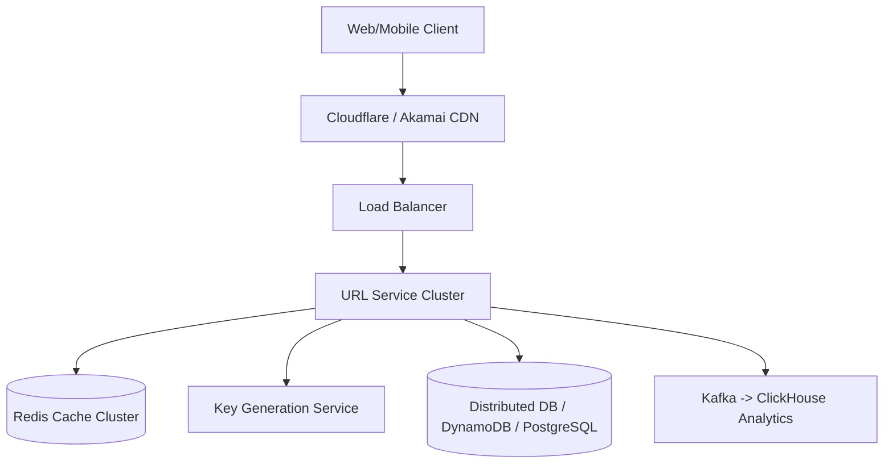

# System Design Architecture: Design URL Shortener (TinyURL / Bitly)

## 1. Requirements & Scope
- **Functional Requirements**: Core user workflows and contracts.
- **Non-Functional Requirements**: High availability, P99 latency goals, consistency trade-offs.

---

## 2. Scale & Back-of-the-Envelope Estimation
- **DAU**: 100 Million daily active users
- **WRITES**: 100 Million new URLs created per month (~40 writes/sec average, ~120 writes/sec peak)
- **READS**: 10 Billion URL redirects per month (~4,000 reads/sec average, ~12,000 reads/sec peak)
- **RATIO**: 100 : 1 Read to Write ratio
- **STORAGE**: 500 bytes per URL mapping. 100M * 500B = 50 GB/month -> 3 TB over 5 years
- **CACHE**: 20% hot URLs generate 80% traffic. 0.20 * 4,000 reads/s * 86,400s * 500B ≈ 35 GB RAM required

---

## 3. API Contracts & Data Schema
### API Endpoints
- `POST /api/v1/urls -> { long_url: string, custom_alias?: string, expire_at?: timestamp } -> { short_url: string }`
- `GET /{short_code} -> 301/302 Redirect to long_url`

### Data Schema
```sql
Table: urls
- id: BIGINT PRIMARY KEY (Auto-increment or Distributed Snowflake)
- short_code: VARCHAR(7) UNIQUE INDEX (Base62)
- original_url: VARCHAR(2048) NOT NULL
- user_id: VARCHAR(64) NULL INDEX
- created_at: TIMESTAMP
- expires_at: TIMESTAMP NULL
```

---

## 4. High-Level System Architecture


---

## 5. SDE-III Deep Dives & Bottlenecks
### **Base62 Encoding vs MD5/SHA256**: MD5 produces 128 bits (too long). Truncating MD5 causes collisions. Best solution: Counter-based range allocation via dedicated Key Generation Service (KGS) or Snowflake ID converted to Base62 (62^7 ≈ 3.5 Trillion unique URLs).

### **301 Permanent vs 302 Found**: 301 is cached by browser, reducing server load but losing click analytics. 302 forces requests to hit our server every time for accurate analytics and rate limiting.

### **Cache Stampede Mitigation**: Use Redis Cluster with Cache-Aside pattern. On cache miss, acquire distributed mutex before querying DB to avoid thundering herd.

---

## 6. Interview Checklist
- [ ] Explained tradeoffs between SQL vs NoSQL for this specific data access pattern
- [ ] Addressed single points of failure (SPOF) with redundancy
- [ ] Solved caching stampede / hot partition challenges
- [ ] Defined metric observability and disaster recovery plan
