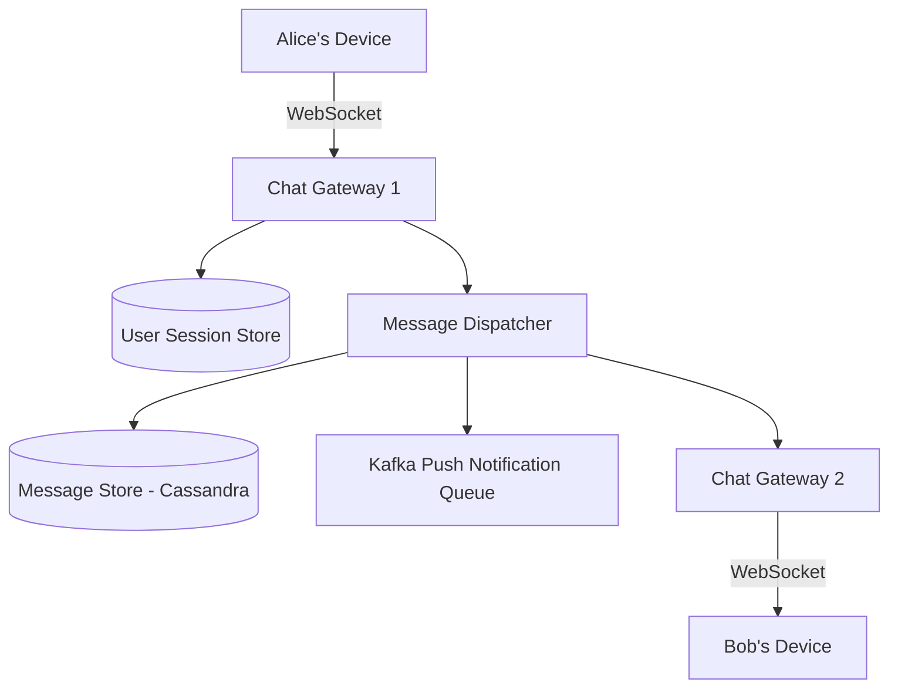

# System Design Architecture: Design Real-Time Messaging (WhatsApp / Slack)

## 1. Requirements & Scope
- **Functional Requirements**: Core user workflows and contracts.
- **Non-Functional Requirements**: High availability, P99 latency goals, consistency trade-offs.

---

## 2. Scale & Back-of-the-Envelope Estimation
- **DAU**: 2 Billion Daily Active Users
- **WRITES**: 100 Billion messages sent per day ≈ 1.15 Million msgs/sec average, 3M peak
- **READS**: 100 Billion messages delivered + status receipts
- **STORAGE**: Average message 100 bytes text. 100B * 100B = 10 TB/day text storage (media stored in Object Storage S3)
- **CONNECTIONS**: Tens of millions of concurrent open WebSocket / TCP connections

---

## 3. API Contracts & Data Schema
### API Endpoints
- `WebSocket ws://chat.domain.com/ws -> Bi-directional binary protocol (E2E Encrypted Protocol Buffers)`
- `POST /api/v1/media/upload -> Multipart file -> { media_url: string, media_key: string }`
- `POST /api/v1/group/create -> { name: string, members: [user_ids] } -> { group_id: string }`

### Data Schema
```sql
Table: messages (Cassandra / ScyllaDB)
- conversation_id: UUID (Partition Key)
- message_id: TIMEUUID (Clustering Key, Ordered Descending)
- sender_id: UUID
- content: BLOB (Client-side encrypted payload)
- status: ENUM ('SENT', 'DELIVERED', 'READ')
- created_at: TIMESTAMP

Table: user_sessions (Redis Cluster)
- user_id: UUID PK
- connection_server_id: VARCHAR(64) (Which WS server holds the socket)
- device_id: VARCHAR(64)
- last_heartbeat: TIMESTAMP
```

---

## 4. High-Level System Architecture


---

## 5. SDE-III Deep Dives & Bottlenecks
### **Persistent Connection Gateways**: Use Netty / Go WebSocket servers. Each server holds ~50k-100k open sockets. A distributed User Session Registry (Redis) maps `user_id -> server_ip` so outgoing messages route to the right box.

### **Offline Message Handling**: If recipient is disconnected, message is stored in Cassandra queue. When recipient reconnects, client sends last synced `message_id`, and server streams pending messages. A Push Notification (APNS/FCM) is triggered for urgent alerts.

### **Group Chat Fan-out**: For groups up to 1,000 members, fan-out on write (push to each member's mailbox queue). For large channels (Slack / Telegram 100k+), fan-out on read with shared channel message history.

---

## 6. Interview Checklist
- [ ] Explained tradeoffs between SQL vs NoSQL for this specific data access pattern
- [ ] Addressed single points of failure (SPOF) with redundancy
- [ ] Solved caching stampede / hot partition challenges
- [ ] Defined metric observability and disaster recovery plan
