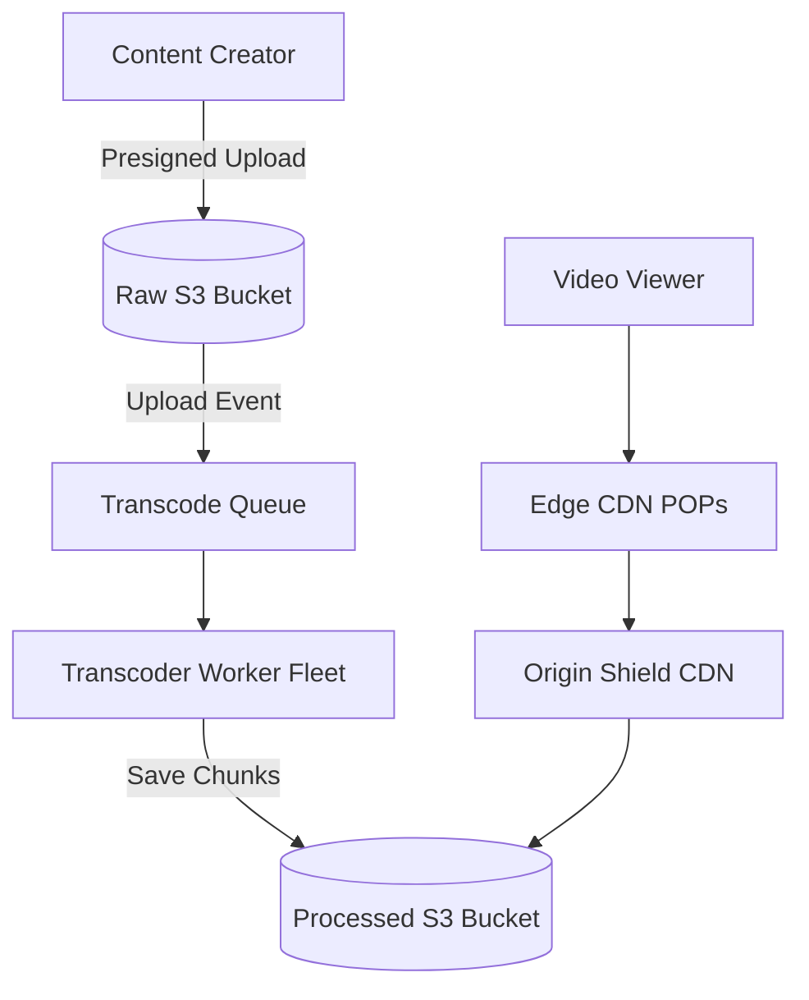

# System Design Architecture: Design Video Streaming Service (YouTube / Netflix)

## 1. Requirements & Scope
- **Functional Requirements**: Core user workflows and contracts.
- **Non-Functional Requirements**: High availability, P99 latency goals, consistency trade-offs.

---

## 2. Scale & Back-of-the-Envelope Estimation
- **DAU**: 2 Billion active users, 500 hours video uploaded every minute
- **WRITES**: Video upload ingestion: 500 hrs/min * 1GB/hr ≈ 8.3 GB/sec raw ingress bandwidth
- **READS**: 1 Billion video hours watched per day ≈ Average 100+ Terabits/sec egress bandwidth
- **STORAGE**: Compressed and transcoded into 6 resolutions (240p to 4K): ~25 Petabytes/day

---

## 3. API Contracts & Data Schema
### API Endpoints
- `POST /api/v1/videos/upload -> Multipart presigned URL for direct S3 upload`
- `GET /api/v1/videos/{video_id}/manifest.m3u8 -> HLS / MPEG-DASH manifest file`
- `GET /api/v1/videos/{video_id}/recommendations -> [video_metadata]`

### Data Schema
```sql
Table: video_metadata (PostgreSQL / CockroachDB)
- video_id: UUID PK
- uploader_id: UUID FK
- title: VARCHAR(255), description: TEXT
- duration_seconds: INT
- manifest_url: VARCHAR(512)
- view_count: BIGINT
- status: ENUM ('UPLOADING', 'PROCESSING', 'READY', 'FAILED')

Table: video_chunks (S3 / Blob Storage)
- s3://videos/{video_id}/720p/chunk_001.ts
- s3://videos/{video_id}/1080p/chunk_001.ts
```

---

## 4. High-Level System Architecture


---

## 5. SDE-III Deep Dives & Bottlenecks
### **Asynchronous Transcoding Pipeline**: Videos uploaded directly to S3 via Presigned URLs. S3 triggers an event to Kafka/SQS. Distributed worker fleet splits video into 4-second chunks and transcodes in parallel using FFmpeg into HLS formats.

### **Adaptive Bitrate Streaming (HLS / DASH)**: Client inspects network bandwidth dynamically. If WiFi drops to 3G, video player switches seamlessly from 1080p chunk_012.ts to 480p chunk_013.ts without buffering.

### **Multi-Tier CDN & Origin Shielding**: 95%+ of video bytes are served from edge CDN pops (Cloudflare/Fastly/Akamai) located in ISPs. An Origin Shield cache absorbs CDN cache misses to prevent collapsing primary S3 buckets.

---

## 6. Interview Checklist
- [ ] Explained tradeoffs between SQL vs NoSQL for this specific data access pattern
- [ ] Addressed single points of failure (SPOF) with redundancy
- [ ] Solved caching stampede / hot partition challenges
- [ ] Defined metric observability and disaster recovery plan
