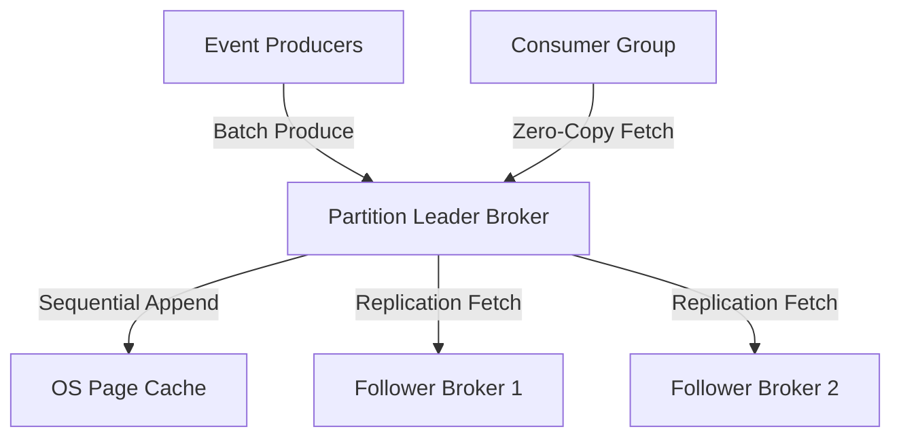

# System Design Architecture: Design Distributed Append-Only Log (Kafka-lite)

## 1. Requirements & Scope
- **Functional Requirements**: Core user workflows and contracts.
- **Non-Functional Requirements**: High availability, P99 latency goals, consistency trade-offs.

---

## 2. Scale & Back-of-the-Envelope Estimation
- **THROUGHPUT**: Millions of events/sec per cluster, multi-gigabyte/sec write & read throughput
- **LATENCY**: Sub-millisecond produce latency with batching
- **DURABILITY**: Zero data loss with In-Sync Replicas (ISR) and distributed commit log

---

## 3. API Contracts & Data Schema
### API Endpoints
- `Produce(topic, partition, key, value, acks=-1)`
- `Fetch(topic, partition, offset, max_bytes)`
- `OffsetCommit(group_id, topic, partition, offset)`

### Data Schema
```sql
Log Segment on Disk:
- {topic}-{partition}/0000000000.log (Binary records appended)
- {topic}-{partition}/0000000000.index (Sparse index: Offset -> Physical Byte Position)
- {topic}-{partition}/0000000000.timeindex (Timestamp -> Offset)
```

---

## 4. High-Level System Architecture


---

## 5. SDE-III Deep Dives & Bottlenecks
### **Sequential Disk I/O & Page Cache**: Kafka relies on OS page cache and linear disk appending. Sequential disk writes are as fast as RAM (hundreds of MB/s) compared to random disk seeks.

### **Zero-Copy Read via `sendfile()`**: Traditional servers read from disk to OS cache, copy to user-space buffer, then write to socket buffer. Kafka issues Linux `sendfile()` system call, streaming bytes directly from OS Page Cache to NIC (Network Card) with zero CPU buffer copies.

### **Partitioning & In-Sync Replicas (ISR)**: Producers write to Partition Leader. Followers fetch log entries. When Leader crashes, Controller promotes an in-sync follower without losing uncommitted transactions.

---

## 6. Interview Checklist
- [ ] Explained tradeoffs between SQL vs NoSQL for this specific data access pattern
- [ ] Addressed single points of failure (SPOF) with redundancy
- [ ] Solved caching stampede / hot partition challenges
- [ ] Defined metric observability and disaster recovery plan
