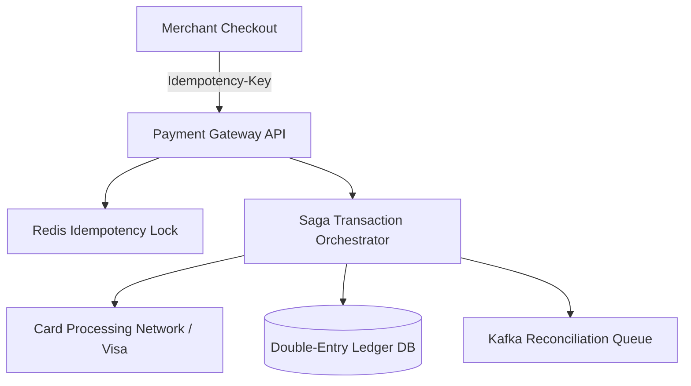

# System Design Architecture: Design Payment Gateway & Ledger (Stripe-lite)

## 1. Requirements & Scope
- **Functional Requirements**: Core user workflows and contracts.
- **Non-Functional Requirements**: High availability, P99 latency goals, consistency trade-offs.

---

## 2. Scale & Back-of-the-Envelope Estimation
- **SCALE_REQ**: 100% financial correctness, zero duplicate charges, ACID guarantees
- **QPS**: 10,000 transactions/sec peak
- **AVAILABILITY**: 99.999% availability with zero tolerance for lost transaction records

---

## 3. API Contracts & Data Schema
### API Endpoints
- `POST /api/v1/charges -> Headers: { Idempotency-Key: uuid } -> Body: { amount: int, currency: 'USD', source_token: '...' }`
- `POST /api/v1/refunds -> { charge_id: string, amount: int }`

### Data Schema
```sql
Table: idempotency_keys
- key: VARCHAR(128) PRIMARY KEY
- status: ENUM ('IN_PROGRESS', 'SUCCESS', 'FAILED')
- response_payload: JSON
- created_at: TIMESTAMP

Table: ledger_entries (Double-Entry Bookkeeping)
- entry_id: UUID PK
- transaction_id: UUID INDEX
- account_id: UUID INDEX
- entry_type: ENUM ('DEBIT', 'CREDIT')
- amount: BIGINT (Stored in cents/paise to avoid float errors)
- created_at: TIMESTAMP
```

---

## 4. High-Level System Architecture


---

## 5. SDE-III Deep Dives & Bottlenecks
### **Idempotency Key Architecture**: Every payment request requires a client-generated UUID `Idempotency-Key`. The gateway acquires a lock in Redis/PostgreSQL for that key. If a retry arrives with same key while original is processing, return HTTP 409 Conflict. If already completed, return cached response immediately without re-charging.

### **Double-Entry Bookkeeping**: Never update a user's balance with `balance = balance + X`. Every financial movement must be recorded as matching DEBIT and CREDIT lines. Sum of all debits must equal sum of credits at all times.

### **Saga Pattern with Compensating Transactions**: When orchestrating multi-party transactions (User Bank -> Payment Gateway -> Merchant Bank), use an Orchestrated Saga. If Merchant Bank fails, trigger automatic compensating refund transactions backwards.

---

## 6. Interview Checklist
- [ ] Explained tradeoffs between SQL vs NoSQL for this specific data access pattern
- [ ] Addressed single points of failure (SPOF) with redundancy
- [ ] Solved caching stampede / hot partition challenges
- [ ] Defined metric observability and disaster recovery plan
