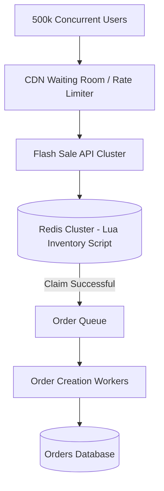

# System Design Architecture: Design Flash Sale Inventory System (Amazon / Flipkart)

## 1. Requirements & Scope
- **Functional Requirements**: Core user workflows and contracts.
- **Non-Functional Requirements**: High availability, P99 latency goals, consistency trade-offs.

---

## 2. Scale & Back-of-the-Envelope Estimation
- **VOLUME**: 10,000 limited units of PlayStation 5, 1 Million users clicking 'BUY' in first 3 seconds
- **QPS**: 500,000 requests/sec peak ingress
- **GUARANTEE**: Zero overselling (never sell 10,001 items), low checkout latency

---

## 3. API Contracts & Data Schema
### API Endpoints
- `POST /api/v1/flash-sale/join-queue -> { user_id, item_id } -> { queue_token: string }`
- `POST /api/v1/order/claim -> { queue_token, item_id } -> { reservation_id: string, ttl: 600 }`

### Data Schema
```sql
Redis Key: item:{item_id}:inventory = 10000

Table: reservations (PostgreSQL / DynamoDB)
- reservation_id: UUID PK
- user_id: UUID
- item_id: UUID
- status: ENUM ('RESERVED', 'PURCHASED', 'EXPIRED')
- expires_at: TIMESTAMP (10 minutes TTL)
```

---

## 4. High-Level System Architecture


---

## 5. SDE-III Deep Dives & Bottlenecks
### **Redis Atomic Decrement with Lua Script**: Never do `SELECT stock FROM db` followed by `UPDATE stock SET stock = stock - 1`. Under 500k QPS, this causes dirty reads and race conditions. Run an atomic Redis Lua script: if stock > 0, decrement and return success; else return sold out instantly.

### **Virtual Waiting Room / Queue**: Front the flash sale with Cloudflare Waiting Room or custom Redis token bucket. Only allow 10,000 users per minute into checkout flow to protect relational databases.

### **Asynchronous Order Settlement**: Successful inventory claims push order creation tasks into Kafka. Consumers create pending orders with 10-minute payment expiration timers.

---

## 6. Interview Checklist
- [ ] Explained tradeoffs between SQL vs NoSQL for this specific data access pattern
- [ ] Addressed single points of failure (SPOF) with redundancy
- [ ] Solved caching stampede / hot partition challenges
- [ ] Defined metric observability and disaster recovery plan
