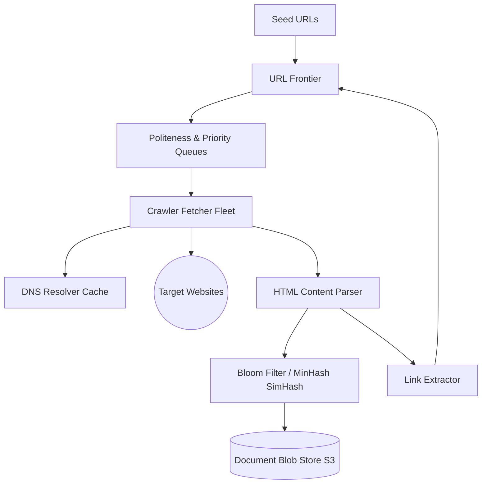

# System Design Architecture: Design Distributed Web Crawler

## 1. Requirements & Scope
- **Scale**: Crawl 1 Billion web pages per month (~400 pages/second continuous).
- **Core Functionality**: Distributed BFS traversal of the web, link extraction, HTML storage.
- **Constraints**: Strict politeness policy (do not overwhelm target hostnames), respect robots.txt.

---

## 2. Scale & Back-of-the-Envelope Estimation
- **Storage**: Average web page size (text + metadata) = 100 KB. 1 Billion pages = 100 TB/month storage.
- **Network Bandwidth**: 400 pages/s * 100 KB ≈ 40 MB/s incoming bandwidth.
- **URL Frontier**: 10 Billion candidate URLs discovered in queue. URL size = 100 bytes -> 1 TB RAM/Disk queue.

---

## 3. API Contracts & Data Schema
### URL Queue Item
```json
{
  "url": "https://example.com/blog/article-1",
  "domain": "example.com",
  "priority": 1,
  "depth": 3,
  "last_crawled_at": null
}
```

---

## 4. High-Level System Architecture


---

## 5. SDE-III Deep Dives & Bottlenecks
### URL Frontier & Politeness Queue Design
To prevent DDoS-ing web servers, separate the frontier into:
1. **Priority Queues (F1...Fn)**: URLs prioritized by PageRank / domain quality.
2. **Politeness Queues (B1...Bm)**: One queue per unique hostname (e.g. `wikipedia.org`). A worker fetching from queue $B_k$ must wait $\Delta t$ seconds (e.g., 500ms) before hitting the same host again.

### Duplicate Detection at Scale
1. **URL Deduplication**: Bloom filter in memory (99.9% accuracy with low bits/entry) backed by persistent disk key-value store (RocksDB).
2. **Content Deduplication (Near-Duplicates)**: Use **SimHash** / **MinHash** fingerprints to identify identical or slightly modified mirror pages.
